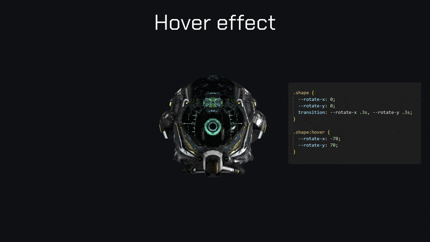

<p align="center">
  
</p>
<h1 align="center">StringTune-3D</h1>
<p align="center">
  <strong>CSS-driven 3D graphics for the web</strong>
</p>

<p align="center">
  <a href="https://www.npmjs.com/package/string-tune-3d"></a>
  <a href="https://github.com/penev-palemiya/StringTune-3D/blob/main/LICENSE"></a>
  <a href="https://www.typescriptlang.org/"></a>
  <a href="https://threejs.org/"></a>
</p>

<p align="center">
  <a href="#features">Features</a> •
  <a href="#installation">Installation</a> •
  <a href="#quick-start">Quick Start</a> •
  <a href="https://penev.tech/string-tune-3d/overview">Documentation</a> •
  <a href="#examples">Examples</a>
</p>

---

<p align="center">
  
</p>

## Overview

**StringTune-3D** is a 3D graphics module for the [StringTune](https://github.com/fiddle-digital/string-tune) ecosystem that lets you control 3D objects through **CSS custom properties**. No imperative Three.js code — just HTML attributes and CSS.

```html
<div
  string="3d"
  string-3d="sphere"
  style="
    width: 150px;
    height: 150px;
    --material-color: #667eea;
    --rotate-y: 45;
    --material-metalness: 0.8;
  "
></div>
```

> **Note**: StringTune-3D requires the base `@fiddle-digital/string-tune` package.

---

## Features

| Feature           | Description                                                          |
| ----------------- | -------------------------------------------------------------------- |
| 🎨 **CSS-First**  | Control transforms, materials, and effects via CSS custom properties |
| 🔄 **Auto-Sync**  | 3D objects automatically follow DOM element position and size        |
| 📦 **Primitives** | Box, sphere, plane, cylinder + GLTF/GLB model loading                |
| 💡 **Lighting**   | Ambient, directional, point, spot, and hemisphere lights             |
| ✨ **Filters**    | Blur, bloom, pixel effects through `--filter` property               |
| 🎭 **Materials**  | Basic, standard PBR, and custom shader materials                     |
| 🔤 **3D Text**    | Extruded text geometry with bevel support                            |
| 🌟 **Particles**  | Emitter and instanced particle systems                               |

---

## Installation

```bash
# Install dependencies
npm install @fiddle-digital/string-tune string-tune-3d three
```

---

## Quick Start

### 1. Setup

```typescript
import { StringTune } from "@fiddle-digital/string-tune";
import { String3D, ThreeJSProvider } from "string-tune-3d";
import * as THREE from "three";

// Configure Three.js provider
String3D.setProvider(new ThreeJSProvider(THREE));

// Initialize StringTune with 3D module
const stringTune = StringTune.getInstance();
stringTune.use(String3D);
stringTune.start(60);
```

### 2. Add 3D Objects

```html
<!-- Lighting -->
<div
  string="3d"
  string-3d="ambientLight"
  style="--light-intensity: 0.5"
></div>
<div
  string="3d"
  string-3d="directionalLight"
  style="--light-intensity: 1"
></div>

<!-- 3D Box -->
<div
  string="3d"
  string-3d="box"
  style="
    width: 150px;
    height: 150px;
    --material-type: standard;
    --material-color: #667eea;
    --material-metalness: 0.5;
    --rotate-y: 20;
  "
></div>
```

### 3. Animate with CSS

```css
.my-3d-object {
  --rotate-y: 0;
  transition: --rotate-y 0.4s ease;
}

.my-3d-object:hover {
  --rotate-y: 180;
}
```

---

## Examples

### Metallic Sphere

```html
<div
  string="3d"
  string-3d="sphere"
  style="
    --material-type: standard;
    --material-color: #c0c0c0;
    --material-metalness: 1;
    --material-roughness: 0.1;
  "
></div>
```

### Glowing Object with Bloom

```html
<div
  string="3d"
  string-3d="box"
  style="
    --material-emissive: #ff0066;
    --filter: bloom(0.6, 0.3);
  "
></div>
```

### Load 3D Model

```html
<div
  string="3d"
  string-3d="model"
  string-3d-model="/models/robot.glb"
  string-3d-model-fit="contain"
  style="width: 300px; height: 300px;"
></div>
```

---

## CSS Properties

| Property                   | Description                    |
| -------------------------- | ------------------------------ |
| `--translate-x/y/z`        | Position offset                |
| `--rotate-x/y/z`           | Rotation in degrees            |
| `--scale`, `--scale-x/y/z` | Scale multipliers              |
| `--opacity`                | Transparency (0-1)             |
| `--material-type`          | `basic`, `standard`, or custom |
| `--material-color`         | Surface color                  |
| `--material-metalness`     | Metallic look (0-1)            |
| `--material-roughness`     | Surface roughness (0-1)        |
| `--filter`                 | Post-processing effects        |

📖 **[Full CSS Reference →](https://penev.tech/string-tune-3d/reference/css-properties)**

---

## Documentation

| Guide                                                                          | Description                 |
| ------------------------------------------------------------------------------ | --------------------------- |
| [Installation](https://penev.tech/string-tune-3d/getting-started/installation) | Setup and dependencies      |
| [Quick Start](https://penev.tech/string-tune-3d/getting-started/quick-start)   | First 3D scene              |
| [Core Concepts](https://penev.tech/string-tune-3d/getting-started/concepts)    | Architecture overview       |
| [CSS Properties](https://penev.tech/string-tune-3d/reference/css-properties)   | Complete property reference |
| [3D Objects](https://penev.tech/string-tune-3d/reference/3d-objects)           | Available object types      |
| [Materials](https://penev.tech/string-tune-3d/reference/materials)             | Material & texture system   |
| [Lighting](https://penev.tech/string-tune-3d/reference/lighting)               | Light types & shadows       |
| [Filters](https://penev.tech/string-tune-3d/reference/filters)                 | Post-processing effects     |
| [Performance](https://penev.tech/string-tune-3d/advanced/performance)          | Optimization tips           |

---

## Browser Support

| Browser | Version |
| ------- | ------- |
| Chrome  | 56+     |
| Firefox | 51+     |
| Safari  | 11+     |
| Edge    | 79+     |

---

## Contributing

Contributions are welcome! Please read our contributing guidelines before submitting PRs.

```bash
# Clone and install
git clone https://github.com/penev-palemiya/StringTune-3D.git
cd string-tune-3d
npm install

# Build
npm run build
```

---

## License

MIT © [penev.tech](https://penev.tech)

---

<p align="center">
  <a href="https://github.com/fiddle-digital/string-tune">StringTune</a> •
  <a href="https://penev.tech/string-tune-3d/overview">Documentation</a> •
  <a href="https://github.com/penev-palemiya/StringTune-3D/issues">Report Bug</a>
</p>
